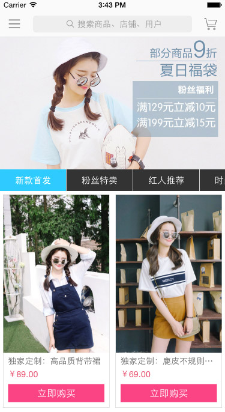
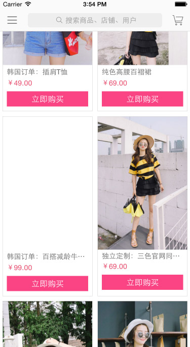

Simple example of trade activity using the ListView API in React Native.

Now, I've some troubles:
	
1、stickyHeaderIndices              //It doesn't work in ListView

2、removeClippedSubviews            //If I use this property, when I scroll listView to the bottom, and then scroll back to the top、switch category, image of listView doesn't update.

3、Sometimes, I meet picture load failed. just like →_→

