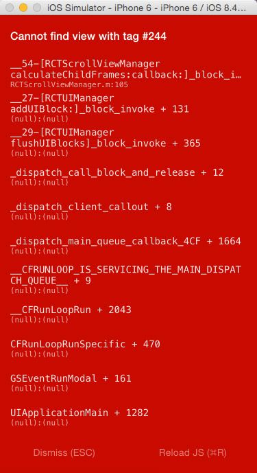

Simple example2 of trade activity using the ScrollView and ListView API in React Native.

When I set ListView in ScrollView, I find some property of ListView has mistakes.

1、The count of list data become less than responseData, sometimes only show 10 items.

2、maby I write wrong styles, the price's position is not right, just like the picture shows.

3、Occasionally, this crash would appear. it happening when I sliding page or click someting.

also, you can see the Tabs can't swipe to left or right.

